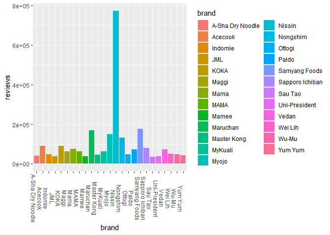
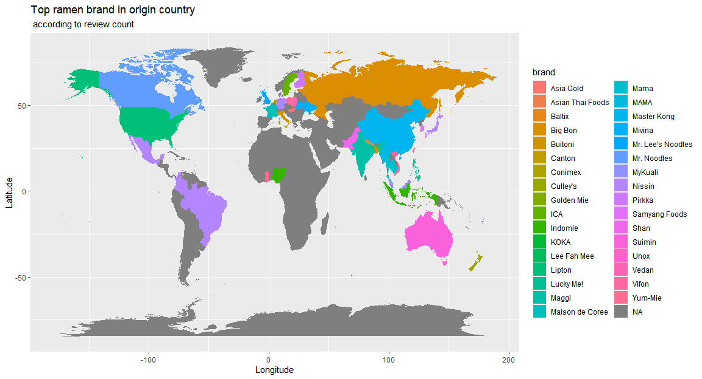
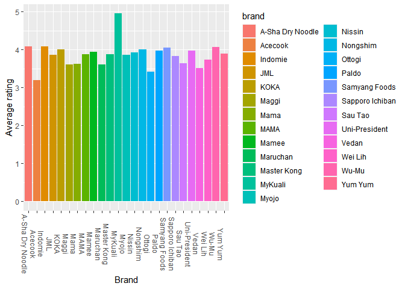
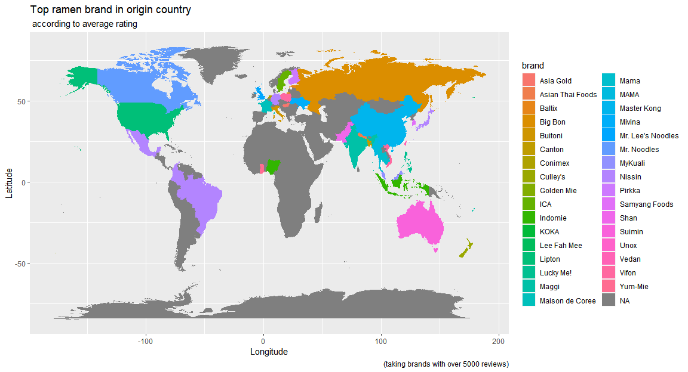

Ramen ratings
================

This was a short analysis I did using an old TidyTuesday dataset for
ramen ratings. It was an enjoyable experience, as I figured out how to
graph data on maps\! These were the resulting graphs.

## Top 25 ramen brands by review number:

It looks like Nissin was the winner here.

<!-- -->

## Top ramen brand for each country by review count

Unfortunately, due to missing data I could only visualize the top brands
for their respective origin countries.

<!-- -->

## Top ramen brands by average rating

MyKuali wins this round. I filtered to only include brands with over 100
reviews to root out brands with lower review counts who had all 5-stars.

<!-- -->

## Top ramen brands in their origin countries according to average rating

There don’t appear to be many differences from the map using brands
sorted by review count.

<!-- -->

## Top ramen style by country (according to review count)

Finally, I looked at preferred ramen style.

<!-- -->

## A couple of linear regressions.

Finally, I ran a couple regressions, which weren’t very accurate, as
indicated by the low adjusted R-squared values.

<table style="border-collapse:collapse; border:none;">

<tr>

<th style="border-top: double; text-align:center; font-style:normal; font-weight:bold; padding:0.2cm;  text-align:left; ">

 

</th>

<th colspan="1" style="border-top: double; text-align:center; font-style:normal; font-weight:bold; padding:0.2cm; ">

review\_number

</th>

<th colspan="1" style="border-top: double; text-align:center; font-style:normal; font-weight:bold; padding:0.2cm; ">

review\_number

</th>

</tr>

<tr>

<td style=" text-align:center; border-bottom:1px solid; font-style:italic; font-weight:normal;  text-align:left; ">

Predictors

</td>

<td style=" text-align:center; border-bottom:1px solid; font-style:italic; font-weight:normal;  ">

Estimates

</td>

<td style=" text-align:center; border-bottom:1px solid; font-style:italic; font-weight:normal;  ">

Estimates

</td>

</tr>

<tr>

<td style=" padding:0.2cm; text-align:left; vertical-align:top; text-align:left; ">

(Intercept)

</td>

<td style=" padding:0.2cm; text-align:left; vertical-align:top; text-align:center;  ">

1709.19 \*\*\*

</td>

<td style=" padding:0.2cm; text-align:left; vertical-align:top; text-align:center;  ">

1524.27 \*\*\*

</td>

</tr>

<tr>

<td style=" padding:0.2cm; text-align:left; vertical-align:top; text-align:left; ">

style \[Box\]

</td>

<td style=" padding:0.2cm; text-align:left; vertical-align:top; text-align:center;  ">

636.25 

</td>

<td style=" padding:0.2cm; text-align:left; vertical-align:top; text-align:center;  ">

</td>

</tr>

<tr>

<td style=" padding:0.2cm; text-align:left; vertical-align:top; text-align:left; ">

style \[Cup\]

</td>

<td style=" padding:0.2cm; text-align:left; vertical-align:top; text-align:center;  ">

144.53 \*

</td>

<td style=" padding:0.2cm; text-align:left; vertical-align:top; text-align:center;  ">

</td>

</tr>

<tr>

<td style=" padding:0.2cm; text-align:left; vertical-align:top; text-align:left; ">

style \[Pack\]

</td>

<td style=" padding:0.2cm; text-align:left; vertical-align:top; text-align:center;  ">

\-170.71 \*\*

</td>

<td style=" padding:0.2cm; text-align:left; vertical-align:top; text-align:center;  ">

</td>

</tr>

<tr>

<td style=" padding:0.2cm; text-align:left; vertical-align:top; text-align:left; ">

style \[Tray\]

</td>

<td style=" padding:0.2cm; text-align:left; vertical-align:top; text-align:center;  ">

\-293.91 \*\*

</td>

<td style=" padding:0.2cm; text-align:left; vertical-align:top; text-align:center;  ">

</td>

</tr>

<tr>

<td style=" padding:0.2cm; text-align:left; vertical-align:top; text-align:left; ">

brand \[Acecook\]

</td>

<td style=" padding:0.2cm; text-align:left; vertical-align:top; text-align:center;  ">

732.80 \*\*\*

</td>

<td style=" padding:0.2cm; text-align:left; vertical-align:top; text-align:center;  ">

935.06 \*\*\*

</td>

</tr>

<tr>

<td style=" padding:0.2cm; text-align:left; vertical-align:top; text-align:left; ">

brand \[Indomie\]

</td>

<td style=" padding:0.2cm; text-align:left; vertical-align:top; text-align:center;  ">

\-720.81 \*\*\*

</td>

<td style=" padding:0.2cm; text-align:left; vertical-align:top; text-align:center;  ">

\-658.41 \*\*\*

</td>

</tr>

<tr>

<td style=" padding:0.2cm; text-align:left; vertical-align:top; text-align:left; ">

brand \[JML\]

</td>

<td style=" padding:0.2cm; text-align:left; vertical-align:top; text-align:center;  ">

\-119.39 

</td>

<td style=" padding:0.2cm; text-align:left; vertical-align:top; text-align:center;  ">

\-37.69 

</td>

</tr>

<tr>

<td style=" padding:0.2cm; text-align:left; vertical-align:top; text-align:left; ">

brand \[KOKA\]

</td>

<td style=" padding:0.2cm; text-align:left; vertical-align:top; text-align:center;  ">

878.83 \*\*\*

</td>

<td style=" padding:0.2cm; text-align:left; vertical-align:top; text-align:center;  ">

1008.34 \*\*\*

</td>

</tr>

<tr>

<td style=" padding:0.2cm; text-align:left; vertical-align:top; text-align:left; ">

brand \[Maggi\]

</td>

<td style=" padding:0.2cm; text-align:left; vertical-align:top; text-align:center;  ">

51.52 

</td>

<td style=" padding:0.2cm; text-align:left; vertical-align:top; text-align:center;  ">

98.91 

</td>

</tr>

<tr>

<td style=" padding:0.2cm; text-align:left; vertical-align:top; text-align:left; ">

brand \[Mama\]

</td>

<td style=" padding:0.2cm; text-align:left; vertical-align:top; text-align:center;  ">

\-585.29 \*\*

</td>

<td style=" padding:0.2cm; text-align:left; vertical-align:top; text-align:center;  ">

\-477.10 \*

</td>

</tr>

<tr>

<td style=" padding:0.2cm; text-align:left; vertical-align:top; text-align:left; ">

brand \[MAMA\]

</td>

<td style=" padding:0.2cm; text-align:left; vertical-align:top; text-align:center;  ">

555.51 \*

</td>

<td style=" padding:0.2cm; text-align:left; vertical-align:top; text-align:center;  ">

614.11 \*\*

</td>

</tr>

<tr>

<td style=" padding:0.2cm; text-align:left; vertical-align:top; text-align:left; ">

brand \[Mamee\]

</td>

<td style=" padding:0.2cm; text-align:left; vertical-align:top; text-align:center;  ">

\-286.94 

</td>

<td style=" padding:0.2cm; text-align:left; vertical-align:top; text-align:center;  ">

\-174.89 

</td>

</tr>

<tr>

<td style=" padding:0.2cm; text-align:left; vertical-align:top; text-align:left; ">

brand \[Maruchan\]

</td>

<td style=" padding:0.2cm; text-align:left; vertical-align:top; text-align:center;  ">

\-44.90 

</td>

<td style=" padding:0.2cm; text-align:left; vertical-align:top; text-align:center;  ">

80.02 

</td>

</tr>

<tr>

<td style=" padding:0.2cm; text-align:left; vertical-align:top; text-align:left; ">

brand \[Master Kong\]

</td>

<td style=" padding:0.2cm; text-align:left; vertical-align:top; text-align:center;  ">

18.20 

</td>

<td style=" padding:0.2cm; text-align:left; vertical-align:top; text-align:center;  ">

63.49 

</td>

</tr>

<tr>

<td style=" padding:0.2cm; text-align:left; vertical-align:top; text-align:left; ">

brand \[MyKuali\]

</td>

<td style=" padding:0.2cm; text-align:left; vertical-align:top; text-align:center;  ">

443.81 \*

</td>

<td style=" padding:0.2cm; text-align:left; vertical-align:top; text-align:center;  ">

597.66 \*\*

</td>

</tr>

<tr>

<td style=" padding:0.2cm; text-align:left; vertical-align:top; text-align:left; ">

brand \[Myojo\]

</td>

<td style=" padding:0.2cm; text-align:left; vertical-align:top; text-align:center;  ">

75.76 

</td>

<td style=" padding:0.2cm; text-align:left; vertical-align:top; text-align:center;  ">

145.23 

</td>

</tr>

<tr>

<td style=" padding:0.2cm; text-align:left; vertical-align:top; text-align:left; ">

brand \[Nissin\]

</td>

<td style=" padding:0.2cm; text-align:left; vertical-align:top; text-align:center;  ">

41.79 

</td>

<td style=" padding:0.2cm; text-align:left; vertical-align:top; text-align:center;  ">

217.53 

</td>

</tr>

<tr>

<td style=" padding:0.2cm; text-align:left; vertical-align:top; text-align:left; ">

brand \[Nongshim\]

</td>

<td style=" padding:0.2cm; text-align:left; vertical-align:top; text-align:center;  ">

\-445.31 \*

</td>

<td style=" padding:0.2cm; text-align:left; vertical-align:top; text-align:center;  ">

\-319.07 

</td>

</tr>

<tr>

<td style=" padding:0.2cm; text-align:left; vertical-align:top; text-align:left; ">

brand \[Ottogi\]

</td>

<td style=" padding:0.2cm; text-align:left; vertical-align:top; text-align:center;  ">

\-615.39 \*\*

</td>

<td style=" padding:0.2cm; text-align:left; vertical-align:top; text-align:center;  ">

\-525.16 \*\*

</td>

</tr>

<tr>

<td style=" padding:0.2cm; text-align:left; vertical-align:top; text-align:left; ">

brand \[Paldo\]

</td>

<td style=" padding:0.2cm; text-align:left; vertical-align:top; text-align:center;  ">

\-589.49 \*\*

</td>

<td style=" padding:0.2cm; text-align:left; vertical-align:top; text-align:center;  ">

\-494.24 \*\*

</td>

</tr>

<tr>

<td style=" padding:0.2cm; text-align:left; vertical-align:top; text-align:left; ">

brand \[Samyang Foods\]

</td>

<td style=" padding:0.2cm; text-align:left; vertical-align:top; text-align:center;  ">

548.71 \*\*

</td>

<td style=" padding:0.2cm; text-align:left; vertical-align:top; text-align:center;  ">

644.64 \*\*\*

</td>

</tr>

<tr>

<td style=" padding:0.2cm; text-align:left; vertical-align:top; text-align:left; ">

brand \[Sapporo Ichiban\]

</td>

<td style=" padding:0.2cm; text-align:left; vertical-align:top; text-align:center;  ">

142.54 

</td>

<td style=" padding:0.2cm; text-align:left; vertical-align:top; text-align:center;  ">

285.25 

</td>

</tr>

<tr>

<td style=" padding:0.2cm; text-align:left; vertical-align:top; text-align:left; ">

brand \[Sau Tao\]

</td>

<td style=" padding:0.2cm; text-align:left; vertical-align:top; text-align:center;  ">

244.43 

</td>

<td style=" padding:0.2cm; text-align:left; vertical-align:top; text-align:center;  ">

303.57 

</td>

</tr>

<tr>

<td style=" padding:0.2cm; text-align:left; vertical-align:top; text-align:left; ">

brand \[Uni-President\]

</td>

<td style=" padding:0.2cm; text-align:left; vertical-align:top; text-align:center;  ">

688.16 \*\*

</td>

<td style=" padding:0.2cm; text-align:left; vertical-align:top; text-align:center;  ">

818.11 \*\*

</td>

</tr>

<tr>

<td style=" padding:0.2cm; text-align:left; vertical-align:top; text-align:left; ">

brand \[Vedan\]

</td>

<td style=" padding:0.2cm; text-align:left; vertical-align:top; text-align:center;  ">

890.36 \*\*\*

</td>

<td style=" padding:0.2cm; text-align:left; vertical-align:top; text-align:center;  ">

1034.45 \*\*\*

</td>

</tr>

<tr>

<td style=" padding:0.2cm; text-align:left; vertical-align:top; text-align:left; ">

brand \[Wei Lih\]

</td>

<td style=" padding:0.2cm; text-align:left; vertical-align:top; text-align:center;  ">

335.24 

</td>

<td style=" padding:0.2cm; text-align:left; vertical-align:top; text-align:center;  ">

388.85 

</td>

</tr>

<tr>

<td style=" padding:0.2cm; text-align:left; vertical-align:top; text-align:left; ">

brand \[Wu-Mu\]

</td>

<td style=" padding:0.2cm; text-align:left; vertical-align:top; text-align:center;  ">

538.12 \*

</td>

<td style=" padding:0.2cm; text-align:left; vertical-align:top; text-align:center;  ">

552.34 \*

</td>

</tr>

<tr>

<td style=" padding:0.2cm; text-align:left; vertical-align:top; text-align:left; ">

brand \[Yum Yum\]

</td>

<td style=" padding:0.2cm; text-align:left; vertical-align:top; text-align:center;  ">

369.71 

</td>

<td style=" padding:0.2cm; text-align:left; vertical-align:top; text-align:center;  ">

471.09 \*

</td>

</tr>

<tr>

<td style=" padding:0.2cm; text-align:left; vertical-align:top; text-align:left; padding-top:0.1cm; padding-bottom:0.1cm; border-top:1px solid;">

Observations

</td>

<td style=" padding:0.2cm; text-align:left; vertical-align:top; padding-top:0.1cm; padding-bottom:0.1cm; text-align:left; border-top:1px solid;" colspan="1">

1532

</td>

<td style=" padding:0.2cm; text-align:left; vertical-align:top; padding-top:0.1cm; padding-bottom:0.1cm; text-align:left; border-top:1px solid;" colspan="1">

1532

</td>

</tr>

<tr>

<td style=" padding:0.2cm; text-align:left; vertical-align:top; text-align:left; padding-top:0.1cm; padding-bottom:0.1cm;">

R2 / R2 adjusted

</td>

<td style=" padding:0.2cm; text-align:left; vertical-align:top; padding-top:0.1cm; padding-bottom:0.1cm; text-align:left;" colspan="1">

0.227 / 0.213

</td>

<td style=" padding:0.2cm; text-align:left; vertical-align:top; padding-top:0.1cm; padding-bottom:0.1cm; text-align:left;" colspan="1">

0.205 / 0.192

</td>

</tr>

<tr>

<td colspan="3" style="font-style:italic; border-top:double black; text-align:right;">

  - p\<0.05   \*\* p\<0.01   \*\*\* p\<0.001
    </td>
    </tr>

</table>
